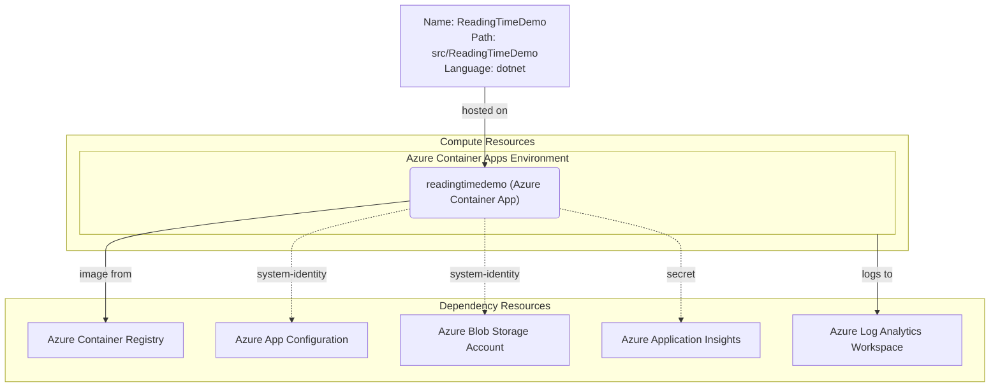

# Azure Deployment Plan for ReadingTimeDemo

## **Goal**
Deploy the ReadingTimeDemo .NET 10 ASP.NET Core MVC application to Azure Container Apps using Azure CLI and Bicep for infrastructure provisioning. The app relies on Azure App Configuration and Azure Blob Storage via Managed Identity.

---

## **Project Information**

**ReadingTimeDemo**
- **Stack**: ASP.NET Core 10.0 MVC
- **Type**: Reading time tracker web application
- **Containerization**: Dockerfile present at `src/ReadingTimeDemo/Dockerfile`
- **Docker Build Context**: `src/ReadingTimeDemo/`
- **Dependencies**:
  - Azure App Configuration (Managed Identity) — app settings externalized
  - Azure Blob Storage (Managed Identity) — static asset serving
  - Azure Container Registry — image storage
  - Azure Application Insights — telemetry
- **Hosting**: Azure Container Apps
- **Port**: 8080

---

## **Azure Resources Architecture**

> **Install the mermaid extension in IDE to view the architecture.**

---

## **Existing Azure Resources**

| Resource Type              | Name | SKU         | Purpose                                           |
|---------------------------|------|-------------|---------------------------------------------------|
| *(to be discovered/provisioned)* | —    | —           | No existing resources detected — will provision   |

**Missing Resources (to provision via Bicep):**
- Azure Resource Group
- Azure Container Registry (ACR)
- Azure Container Apps Environment
- Azure Container App (`readingtimedemo`)
- Azure App Configuration
- Azure Storage Account (Blob)
- Azure Log Analytics Workspace
- Azure Application Insights

---

## **Execution Steps**

> **Below are the steps for Copilot to follow. Add check list for the steps.**
> **CRITICAL: Do NOT run `az login` until 'Env setup' step.**

### Step 1 — Containerization
- [x] Dockerfile exists at `src/ReadingTimeDemo/Dockerfile` (updated to .NET 10 with non-root user, healthcheck, and .dockerignore)
- [x] Enhance Dockerfile: add non-root user, HEALTHCHECK, and `.dockerignore`
- [ ] Build image using `az acr build` after ACR is provisioned

### Step 2 — Env Setup for AzCLI
- [ ] Verify `az` CLI is installed
- [ ] Confirm active subscription with `az account show`
- [ ] Install service connector extension: `az extension add --name serviceconnector-passwordless --upgrade`

### Step 3 — Provisioning
- [ ] Use `infrastructure-bicep-generation` skill to generate Bicep IaC files
- [ ] Provision all missing Azure resources via Bicep

### Step 4 — Check Azure Resources Existence
- [ ] Azure Container App `readingtimedemo` — check with `az containerapp show -o json`
- [ ] Azure App Configuration — check existence
- [ ] Azure Storage Account — check existence
- [ ] Azure Container Registry — check login server with `az acr show -o json`
- [ ] Create any missing resources identified

### Step 5 — Deployment
- [ ] Build and push Docker image to ACR using `az acr build`
- [ ] Create deploy script in `deploy-scripts/`
- [ ] Deploy container app using Azure CLI
- [ ] Validate deployment with `appmod-get-app-logs`

### Step 6 — Summarize Result
- [ ] Call `appmod-summarize-result` tool
- [ ] Generate `deployment-summary.md`

---

## **Progress Tracking**
See `progress.md` for real-time status.

---

## **Tools Checklist**
- [x] `appmod-analyze-repository` — called, detected ReadingTimeDemo (.NET 10)
- [x] `appmod-plan-generate-dockerfile` — called, Dockerfile enhancements identified
- [ ] `appmod-build-docker-image`
- [ ] `appmod-summarize-result`
- [ ] `appmod-get-app-logs`
